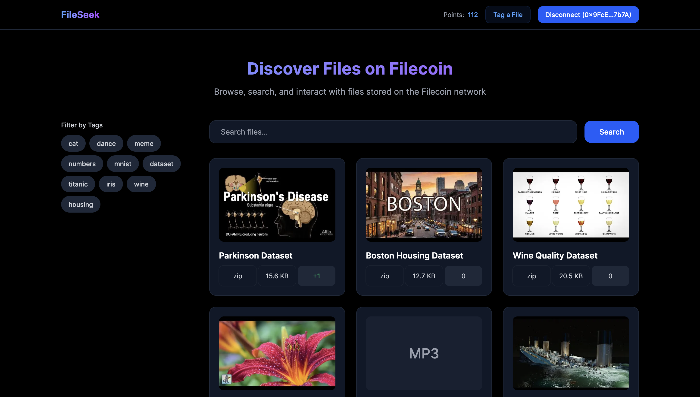

# FileSeek

FileSeek is an application designed to enhance the discoverability and usability of files stored on Filecoin. It allows users to add meaningful tags and metadata, search for files based on these tags, and interact with files through upvotes, downvotes, and comments.



## Problem Statement

File data on Filecoin is stored as hashes with minimal metadata. Users cannot tell what the file contains or even determine the file extension without accessing the file.

## Our Solution

FileSeek provides a user-friendly interface that enables:
- Tagging files with descriptive metadata.
- Searching and filtering files based on file type, tags, upload date, and community upvotes.
- Viewing file details with an option to see a custom thumbnail (if provided) or a default based on file type.
- Engaging with content through votes, comments, and reports.

## Tech Stack

- **Frontend**: Next.js, Shadcn (component library), Tailwind CSS
- **Backend**: Next.js API routes, Supabase
- **Authentication**: MetaMask

## Installation

1. Clone the repository:
   ```bash
   git clone https://github.com/thesanjeevsharma/fileseek.git
   cd fileseek
   ```

2. Install dependencies:
   ```bash
   npm install
   ```

3. Set up environment variables:
   - Create a `.env.local` file in the root directory.
   - Add the following variables:
     ```plaintext
     NEXT_PUBLIC_SUPABASE_URL=your_supabase_url
     NEXT_PUBLIC_SUPABASE_ANON_KEY=your_supabase_anon_key
     ```

4. Run the development server:
   ```bash
   npm run dev
   ```

5. Open [http://localhost:3000](http://localhost:3000) with your browser to see the result.

## Environment Variables

- `NEXT_PUBLIC_SUPABASE_URL`: Your Supabase project URL.
- `NEXT_PUBLIC_SUPABASE_ANON_KEY`: Your Supabase anonymous key.

## Demo

[Placeholder for a demo video]

## Contributors

- [Sanjeev Sharma](https://linkedin.com/in/thesanjeevsharma)

## Project Plan
For a detailed project plan and database schema, refer [spec.md](spec.md).

## Acknowledgments

- Filecoin for providing the storage infrastructure.
- Supabase for the database and authentication services.
- Lighthouse for providing an open API to check file availability.
- MetaMask for wallet authentication.